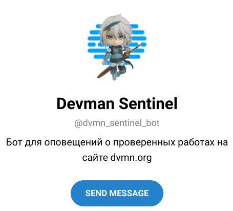

# Devman Sentinel



Я - страж башни Devman! Я всегда знаю, когда седовласые мудрецы принимают решение,
и готов рассказать тебе об этом за пару монет!

### Пример бота
Доступен по ссылке в Телеграм: [Devman Sentinel](https://t.me/dvmn_sentinel_bot/)

## Запуск

- Рекомендуется использовать виртуальное окружение для запуска проекта
- Для корректной работы Вам необходим Python версии 3.5 и выше
- API-ключ для работы с Telegram-ботом (инструкция [тут](https://way23.ru/%D1%80%D0%B5%D0%B3%D0%B8%D1%81%D1%82%D1%80%D0%B0%D1%86%D0%B8%D1%8F-%D0%B1%D0%BE%D1%82%D0%B0-%D0%B2-telegram.html)).
- Скачайте код
- Установите зависимости командой
```bash
pip install -r requirements.txt
```
- Запустите бота
```bash
python main.py
```

## Переменные окружения

Часть настроек проекта берётся из переменных окружения. Чтобы их определить, 
создайте файл `.env` рядом с `main.py` и запишите туда данные в таком 
формате: `ПЕРЕМЕННАЯ=значение`.

Доступные переменные:

- `TG_BOT_APIKEY` — Ваш API-ключ для работы с Telegram-ботом
- `DVMN_API` — Ваш персональный токен Devman ([Тут](https://dvmn.org/api/docs/))
- `CHAT_ID` — Ваш ID в Телеграм (можно узнать, написав [ему](https://t.me/userinfobot))

## Цели проекта

Код написан в учебных целях — это урок в курсе по Python и веб-разработке на сайте [Devman](https://dvmn.org).